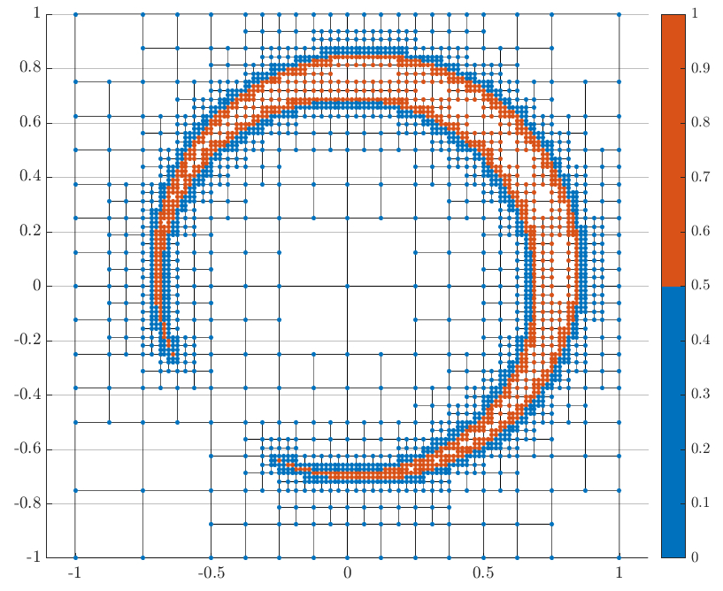

# Adaptive Mesh Refinement



This software supports an adaptive mesh refinement of a two-dimensional grid by comparing a *metric* evaluated at *nodes* on the grid, or *mesh*.

### Installation
Download or pull this repository. From MATLAB, run the `meshToyProblem.m` script and/or the `runAllTests.m` script to verify that the software is running. No additional compilation steps are required.

### Algorithm Overview
*For an example of this code in action, see the `meshToyProblem.m` script*

A mesh refinement problem begins with a *mesh* composed of a single *cell*; each cell is represented by four corners, each an individual *node*. Nodes are characterized by a *metric*, i.e., the value asociated with the (*x*, *y*) position that the node represents. Accordingly, the nodes, represented by the `adaptiveMesh.Node` class, are responsible for computing evaluating the metric. To run an adaptive mesh refinement for your problem of interest, you must first create a class that extends the `adaptiveMesh.Node` class and overrides the `getMetric()` function. An example of a custon Node class is supplied in the `ToyNode` class located in the `tests` folder.

To initialize the mesh, represented by the `adaptiveMesh.Mesh` class, instantiate the object and specify the bounds and node class:
```matlab
mapMesh = adaptiveMesh.Mesh();

bounds = [-1, 1, -2, 2]; 	% rectangle with x-bounds of [-1, 1] and y-bounds of [-2, 2]
templateNode = MyNodeClass(); 	% A node class you have created that extends adaptiveMesh.Node

mapMesh.init(bounds, templateNode)
```
At this point, the mesh is very simple: a single cell with a node at each of the four corners: (*x*, *y*) = { (-1, -2), (-1, 2), (1, 2), (1, -2) }. The next step is to specify the mesh refinement limits, primarily by setting a minimum number of refinement steps and minimum cell dimensions:
```matlab
mapMesh.setMinLevel(2);
mapMesh.setMinCellSize([1e-4, 2e-4]);
```
The minimum level (specified by the `setMinLevel()` function) defines the minimum level of mesh refinement that must occur. When the mesh is initialized to a single cell, that cell is at level 0. Subdividing this level-0 cell yields four cells, each with a level of 1. Similarly, subdividing one of these smaller cells creates four even smaller cells, each at level 2. The mesh refinement is forced to continue until the entire mesh is composed of cells with levels of at least the minimum level. Thus, constraining the minimum level to be 2 guarantees that the single initial cell will be subidivided into 4^2 = 16 cells. Equivalently, the width and height of the initial cell will be split into 2^2 = 4 equally-sized segments.

While the minimum level ensures the refinement does not "quit" too soon, the minimum cell size prevents the refinement from continuing for an infinitely long period of time. A cell is allowed to subdivide as long as the four cells that will be created have dimensions greater than the minimum cell size. In the example code above, the minimum cell width is 1e-4 and the minimum cell height is 2e-4. Thus, a cell with a width smaller than 2e-4 or a height smaller than 4e-4 will not be permitted to subdivide.

Once the mesh settings are configured, call the refine function to run the algorithm:
```matlab
mapMesh.refine()
```
When the refinement process is complete, the refined mesh is available from the mesh class properties, `mapMesh.nodeMap` and `mapMesh.cellMap`. See the example script, `meshToyProblem.m` for an example.

### Documentation

The code is reasonably well documented, and this documentation can be visually inspected via MATLAB's `doc` command:
```matlab
doc adpativeMesh.Cell
doc adpativeMesh.Mesh
doc adaptiveMesh.Node
```
Each of these commands opens the MATLAB web browser to view HTML class documentation.

### Acknowledgements
This software employs an indexing strategy found in the following paper:

* Ji, H., Lien, F.-S., and Yee, E., "A new adaptive mesh refinement data structure with an application to detonation", *Journal of Computational Physics*, 229(**23**), 20 November 2010, pp. 8981--8993. DOI: [10.1016/j.jcp.2010.08.023](https://doi.org/10.1016/j.jcp.2010.08.023)

